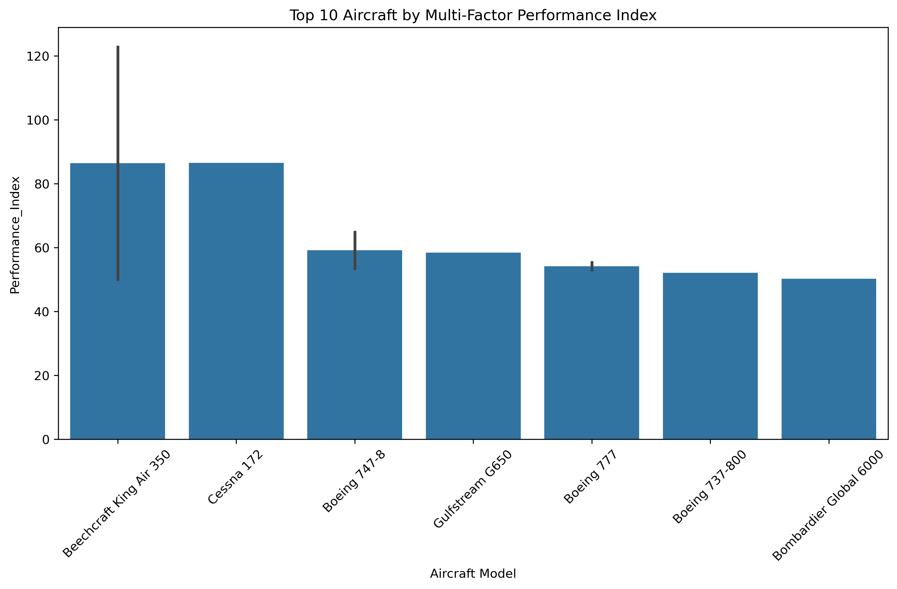

# ✈️ Aircraft Performance & Efficiency Analysis 

## 📌 Overview
This project provides a **comprehensive data-driven analysis** of aircraft performance, payload efficiency, stability margins, and fuel consumption patterns.  
It integrates **Python analytics**, **SQL queries**, and a **Power BI dashboard** (in progress) to help decision-makers in aviation operations and fleet management.

---

## 🎯 Objectives
The project answers the following analytical questions:

- Which aircraft maximize **payload efficiency** relative to MTOW?  
- What is the distribution of **fuel consumption per passenger**?  
- How do **cargo-to-fuel ratios** impact profitability?  
- What is the relationship between **speed and altitude**?  
- How does **engine type** affect operational performance?  
- Are aircraft within safe **stability margins (CG, wing/tail loading)**?  
- Does **fuselage length correlate with passenger density**?

---

## 🗄️ Data
The analysis is based on an **open dataset of aircraft specifications** with the following key columns:

- `Aircraft Model`  
- `Empty Weight (kg)`  
- `Maximum Takeoff Weight (kg)`  
- `Maximum Landing Weight (kg)`  
- `Center of Gravity Limits`  
- `Wing Loading (kg/m²)`  
- `Tail Loading (kg/m²)`  
- `Fuel Capacity (liters)`  
- `Number of Passengers`  
- `Cargo Capacity (kg)`  
- `Maximum Altitude (ft)`  
- `Maximum Speed (knots)`  
- `Engine Type`  
- `Fuselage Length (m)`

---

## 📊 Visual Analysis
Below are the generated charts and their insights:

1. **Passengers per Fuel**  
     
   Evaluates fuel efficiency per passenger.

2. **Passengers per Meter**  
     
   Measures seating density efficiency.

3. **Payload-to-MTOW Ratio**  
     
   Shows structural efficiency of aircraft.

4. **Performance Index**  
     
   Composite metric blending payload, fuel, and efficiency.

5. **Engine Type vs Speed & Altitude**  
     
   Compares engine categories across performance envelopes.

6. **Wing Loading vs Maximum Altitude**  
     
   Aerodynamic trade-offs between load and altitude.

7. **Pairplot Scatter Matrix**  
     
   Visual correlation between multiple key parameters.

8. **Cargo-to-Fuel Ratio**  
     
   Highlights freight efficiency.

9. **CG Limits vs MTOW**  
     
   Evaluates stability and safety envelopes.

10. **Fuel-to-MTOW Ratio**  
      
    Shows weight allocation for fuel.

11. **Fuel per Passenger**  
      
    Evaluates seat economics in fuel terms.

---

## 🏗️ Project Structure
aircraft-performance-analysis/
│── data/
│ └── raw_aircraft_data.csv # Original dataset
│
│── sql/
│ └── queries.sql # All SQL queries used in analysis
│
│── scripts/
│ └── analysis.py # Python script for charts & KPIs
│
│── aircraft_charts/ # Saved charts
│ ├── passengers_per_fuel.png
│ ├── passengers_per_meter.png
│ ├── payload_mtow_ratio.png
│ ├── performance_index.png
│ ├── engine_type_speed_altitude.png
│ ├── wing_loading_vs_max_altitude.png
│ ├── pairplot_scatter_matrix.png
│ ├── cargo_fuel_ratio.png
│ ├── cg_limits_vs_mtow.png
│ ├── fuel_mtow_ratio.png
│ ├── fuel_per_passenger.png
│
│── dashboard/
│ └── AircraftDashboard.pbix # Power BI dashboard (work in progress)
│
│── reports/
│ └── Aircraft_Analysis_Report.pdf # Generated PDF report
│
│── README.md # Project documentation

---

## 🚀 Future Work
- Finalize Power BI dashboard with interactive filters.
- Add predictive models for fuel efficiency and payload optimization.
- Integrate flight operations data for real-world validation.

### 👨‍💻 Author
Mohamed Emad Alhadi  |   Data Analyst with Aerospace Engineering background
